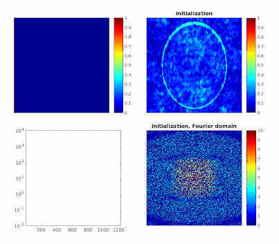

## GIRAF: Generic Iterative Reweighted Annihilating Filter

MATLAB implementation of the GIRAF algorithm for convolutional structured low-rank matrix recovery problems arising
in inverse problems in imaging and signal processing. 
One main application for GIRAF is undersampled MRI reconstruction with _continuous domain compressesd sensing_ regularization penalties.
These penalies model certain continuous domain properties of the image by enfocing a convolutional structured matrix built form k-space (Fourer) data to be low-rank.

The GIRAF algorithm adapts an iterative re-weighted least squares approach
that can be iterpreted alternating between two subproblems:
     (1) updating an annihilating filter for the data, and 
     (2) solving for the data that is optimally nulled 
         by the annhilating filter in a least-squares sense
The animation below shows the iterates of the GIRAF algorithm in the recovery of a
piecewise constant image from missing Fourier data. 
The annihiling filter (here shown in image domain) encodes
the edges of the image:

## Optimzation problem
GIRAF is designed to solve following the optimization problem:

> ||Ax-b||2+&lambda;||T(x)||pSp &nbsp;&nbsp;&nbsp;&nbsp;(OPT)

where _x_ is a mutli-dimensional array of data (typically in Fourier domain), 
_A_ is a linear measurement operator, _b_ is the measured data, 
_T_ is a matrix lifting operator that maps the data _x_ to a Toeplitz-like
matrix, _||.||Sp_ is the [Schatten-p quasi-norm](https://en.wikipedia.org/wiki/Schatten_norm) (0 <= p <= 1), and _&lambda;_
is a regularization parameter. 

## References
GIRAF was introduced in the conference paper:
> [1] Ongie, G., and Jacob, M. "A fast algorithm for structured low-rank matrix recovery with applications to undersampled MRI reconstruction." Biomedical Imaging (ISBI), 2016 IEEE 13th International Symposium on. IEEE, 2016.

A full-length journal version of this work is available as a pre-print:
> [2] Ongie, G., and Jacob, M. "A fast algorithm for convolutional structured low-rank matrix recovery." Online at: https://arxiv.org/abs/1609.07429 

GIRAF is also used in the following paper:
> [3] Balachandrasekaran, A., Ongie, G., Jacob, M. Accelerated dynamic MRI using structured low rank matrix completion. InImage Processing (ICIP), 2016 IEEE International Conference on 2016 Sep 25 (pp. 1858-1862). IEEE.

## Code Details
A standalone implementation of the algorithm is available in `giraf.m`
Demo illustrating GIRAF for undersampled MRI reconstruction are provided in
  * `giraf_demo1.m` - recovery of noiseless undersampled data
  * `giraf_demo2.m` - recovery of noisy & undersampled data
  * `giraf_demo3.m` - effect of filter size on recon quality

## Reproducible Research
Code to reproduce the experiments reported in the paper [2] is provided in the subfolder `reproduce`
This includes implementations of other commonly used algorithms for solving (OPT), including
singular value thresholding and alternating projections.